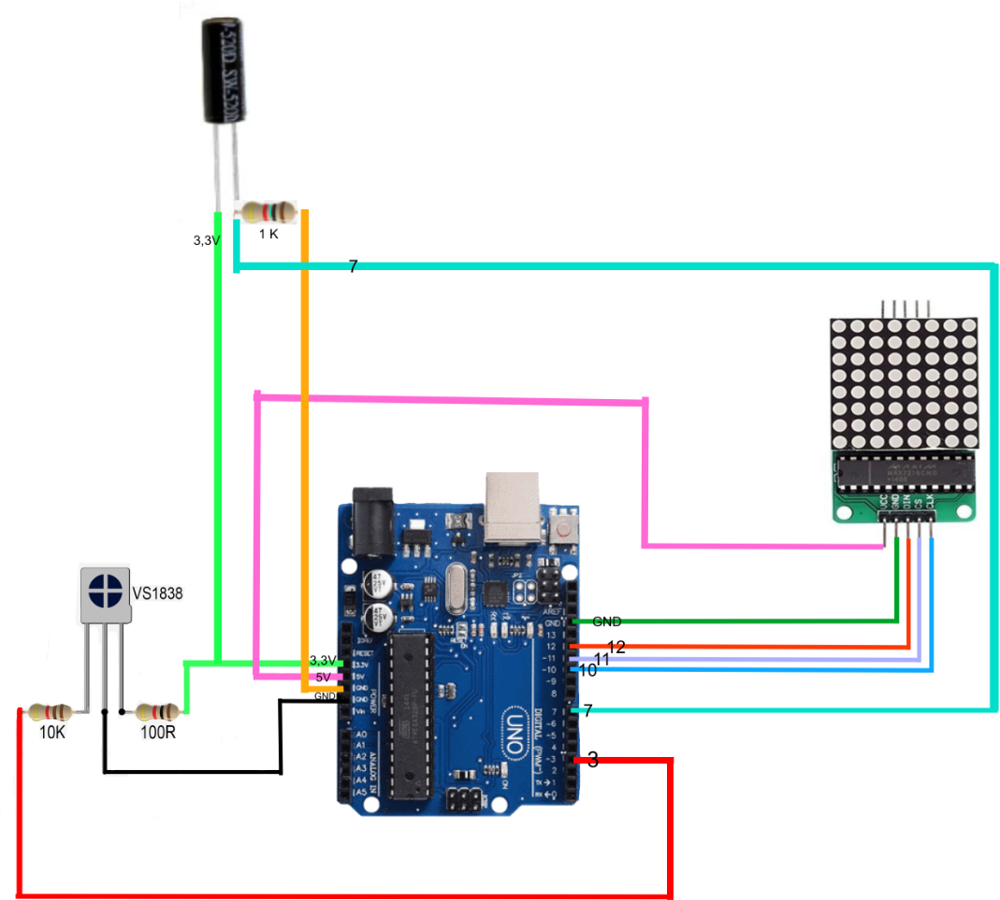

# Interactive Emoji LED Display

## Project Description:
This project aims to create an interactive LED board that displays  emojis based on user input from a remote control. Additionally, it incorporates a SW-520D Vibration Sensor Metal Ball Tilt Sensor to enable image inversion when the board is upside down.

## Screenshots

[(Watch the demo on YouTube)](link)

## Schematics

## Components:

- Arduino UNO R3
- Breadboard and jumper wires 
- LED matrix module 8x8, red, 5V, MAX7219
- 3 resistors ( 1x100R, 1x1K, 1x10K) 
- jumper wires
- SW-520D Vibration Sensor Metal Ball Tilt Sensor
- Remote control
- Interfacing IR Sensor

### 1. Hardware Setup:
- Connect the components as per the provided schematics.
- Ensure proper connections between the Arduino, LED matrix module, resistors, tilt sensor, remote control, and infrared sensor.

### 2. Arduino Programming:
- Upload the provided Arduino sketch (`final.ino`) to your Arduino UNO.
- This sketch contains code to read signals from the infrared sensor, detect button presses on the remote control, and control the LED matrix to display emojis.

### 3. Testing:
- Power on the Arduino and ensure that the LED matrix module is correctly connected.
- Use the remote control to trigger different emojis on the LED display.
- Tilt the board to observe image inversion functionality.

## Troubleshooting:
- If emojis are not displaying correctly, double-check the wiring connections and ensure that the Arduino sketch is uploaded correctly.
- If the tilt sensor functionality is not working, verify the connections and ensure that the sensor is properly calibrated.

## Credits:
This project was developed by [Your Name].

